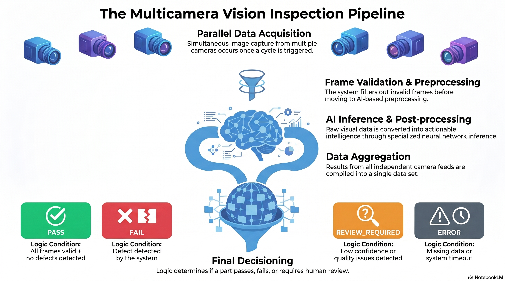
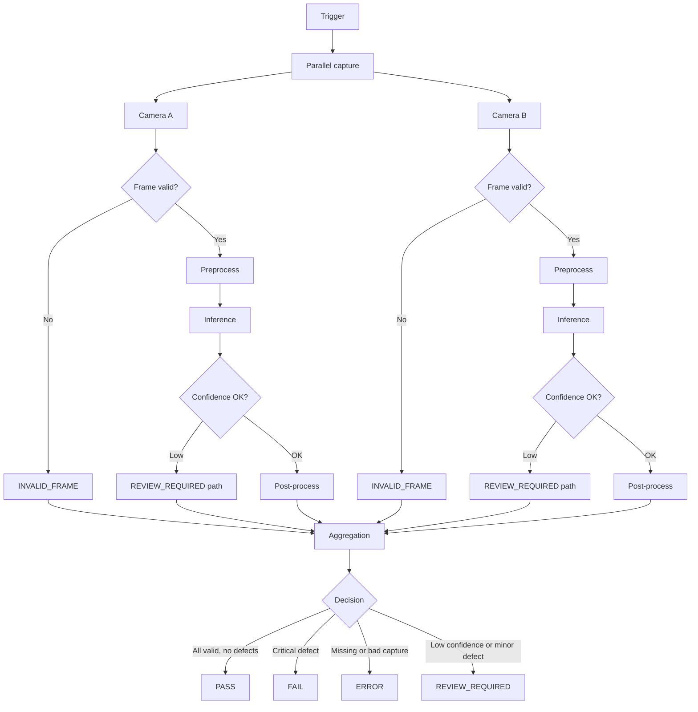
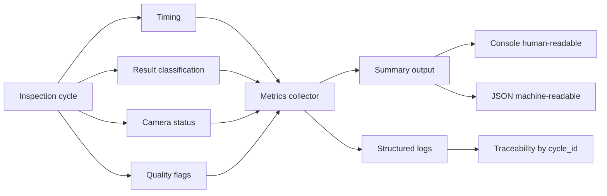

# Offline AI-Guided Manufacturing Inspection

## Evaluation Mapping

This solution was designed to directly address the evaluation criteria:

- **System Design**: Implemented as a deterministic pipeline with strict stage separation (Trigger → Capture → Processing → Aggregation → Report), each isolated into dedicated modules.
- **Product Mindset**: Focused on fail-safe decision-making, prioritizing correctness and safety over throughput, aligned with real manufacturing constraints.
- **Time Management & Mitigations**: Emphasis on architecture and system behavior using mocks, with clear tradeoffs due to time constraints.
- **Project Structure**: Organized by responsibility (controller, camera, pipeline, aggregation, reporting, observability).
- **Performance & Stability**: Includes SLA tracking, bounded execution, retry logic, and guaranteed per-cycle output.
- **Runnable Demo**: Provides a deterministic 10-cycle simulation including both success and failure scenarios.

The goal is to make the system behavior immediately understandable and aligned with production realities.

---

## 1. Project Purpose

This project is a **reference implementation** of a single inspection station that serves **one production line** while remaining **fully offline**. The station accepts a trigger, acquires imagery from **two cameras in parallel** (because both views of the same part must exist at the same physical instant), runs a **strict per-camera vision pipeline**, fuses the evidence into **one line decision**, and records a **JSON inspection report** plus structured logs for audit and debugging.

The “AI” stack is deliberately mocked: there is no real camera SDK and no real neural network. The value of the code is in **separation of concerns**, **fail-safe aggregation**, **bounded waits**, **traceability**, and **operational metrics** that transfer directly to a hardened production deployment.

In manufacturing systems, incorrect PASS decisions are more critical than false FAILs, therefore the system is designed to be fail-safe.

The system models real-world inspection risks such as glare, corrupted frames, and camera timeouts, and translates them into conservative decision-making aligned with manufacturing priorities.

---

## 2. System Architecture

The architecture is intentionally linear: **one cycle at a time**, no queues, no microservices, and no cloud dependencies. Parallelism exists only inside the capture phase, where two blocking camera calls are launched together.

The canonical flow is:

**Trigger → Parallel Capture → Per-Camera Processing → Aggregation → Report**

A trigger (`controller/trigger.py`) identifies the `cycle_id`, `part_id`, and timestamp. The capture service (`camera/capture_service.py`) submits one callable per camera to a `ThreadPoolExecutor`, so both sensors work concurrently while the rest of the cycle stays single-threaded.

Each returned frame is passed through `pipeline/inspection_pipeline.py`, which performs explicit stages:  
**validate frame → preprocess → inference → postprocess**.

Validation failures mark the frame as invalid and skip inference, because running a classifier on unusable pixels would create false confidence.

`aggregation/aggregator.py` then merges both camera outcomes into a single `PASS`, `FAIL`, `ERROR`, or `REVIEW_REQUIRED` decision using strict precedence rules.

Finally, `reporting/reporter.py` serializes the cycle to disk and prints a one-line console summary.

Each inspection cycle is fully self-contained and traceable, ensuring that any part can be analyzed independently without relying on external system state.

## System Flow (Visual)

The following diagrams illustrate the deterministic inspection pipeline, fail-safe decision logic, and how timing, classifications, camera status, and quality flags roll up into metrics, reports, and **`cycle_id`** traceability.

Paths are relative to this file (`inspection_system/README.md`); assets live in the parent folder (`../`).

### 1. Multicamera vision inspection pipeline (infographic)



### 2. Per-cycle control flow (Mermaid + static export)

On **GitHub**, **GitLab**, and many Markdown previews, the diagram below renders interactively. If Mermaid is not available (PDF, some viewers), expand **Static PNG export** below and save or copy the image.



<details>
<summary>Static PNG export — per-cycle control flow (for print / viewers without Mermaid)</summary>

.png)

</details>

### 3. Visual inspection data pipeline (infographic)


### 4. Data and metrics flow (Mermaid + static export)



<details>
<summary>Static PNG export — data &amp; metrics pipeline (for print / viewers without Mermaid)</summary>

.png)

</details>

---

## 3. Production Constraints

A real inspection cell must behave predictably when hardware degrades, operators swap lenses, or ambient light drifts.

- Each cycle must produce a deterministic result  
- The system must never block indefinitely  
- Partial or unreliable data must never produce PASS  

The system enforces bounded execution using per-camera timeouts and controlled retry logic. Failures degrade outcomes conservatively (ERROR / REVIEW_REQUIRED / FAIL).

---

## 4. Time Management & Tradeoffs

Given the constraints of the exercise, the implementation prioritizes **architecture clarity and system behavior** over full production integration.

Key decisions:
- All external dependencies (cameras, inference) are mocked  
- Quality validation uses simplified thresholds instead of real CV algorithms  
- Retry policy is intentionally minimal (single retry) to keep behavior predictable  

Mitigations:
- Clear extension points exist for real implementations  
- Failure scenarios are deterministically simulated for testing  
- SLA monitoring is advisory rather than enforced  

This approach ensures the system remains understandable, testable, and extensible within limited development time.

---

## 5. Performance Targets

The system includes mock SLA budgets defined in configuration:

- Maximum cycle time  
- Capture budget  
- Processing budget  
- Aggregation and reporting budget  

Each stage tracks execution time. SLA violations:
- Are logged  
- Are added to the report  
- Do NOT override inspection decisions  

The system enforces bounded execution through explicit timeouts and retry limits, ensuring that no inspection cycle can block the production line indefinitely.

---

## 6. Failure Modes

The system explicitly models real-world failures:

- Camera timeout  
- Camera disconnect  
- Corrupted frame  
- Glare / overexposure  
- Blur / low quality  
- Low confidence inference  
- Missing camera data  

All failures are translated into safe inspection outcomes:
never PASS.

---

## 7. Recovery Strategy

Recovery is conservative and bounded:

- Retry for transient failures (default: one retry, i.e. two capture attempts per camera — see `capture_max_attempts` in `config.py`)  
- If still failing → mark as ERROR  
- Never retry indefinitely  
- Never block the pipeline  
- Always continue to next cycle  

The system isolates failures per cycle and guarantees output.

---

## 8. Metrics & Observability

The system collects:

- PASS / FAIL / ERROR / REVIEW_REQUIRED counts  
- Failure rate (any non-PASS outcome)  
- Average and max cycle time  
- Camera reliability  
- Low confidence rate  
- SLA violations  

Structured logs include:
- cycle_id  
- stage boundaries  
- errors and warnings  

This enables full operational visibility and debugging.

---

## 9. Traceability

Each inspection cycle is fully traceable:

- Lifecycle timestamps per stage  
- Per-camera results  
- Quality flags  
- Confidence values  
- SLA violations  

A single cycle can be reconstructed end-to-end using logs and reports.

---

## 10. Engineering Decisions

- **Parallel capture** reflects physical reality of simultaneous imaging  
- **Sequential cycles** match single-station production flow  
- **No queue** avoids unnecessary complexity and ordering issues  
- **Offline design** ensures reliability without external dependencies  

Each decision prioritizes simplicity, determinism, and reliability.

---

## 11. What I Would Improve in Production

- Real camera SDK integration (GenICam / vendor SDKs)  
- Real ML models (ONNX / TensorRT)  
- Hardware health monitoring  
- Operator UI / dashboard  
- Persistent storage for audit and analytics  
- Multi-station scaling with queues at plant level  

### What you'd do on a real line

When the inspection cycle triggers, set **`part_id`** from the real process—for example a **barcode or QR** on the fixture, **RFID**, **MES / PLC** serial with station context, or another ID source the plant already trusts. The trigger (`TriggerEvent` in `controller/trigger.py`) carries **`cycle_id`**, **`part_id`**, and **`timestamp`**; those values propagate into frames, pipeline results, and the JSON report. Matching a physical **part** to an **inspection** on the line means: use the same identifier on the trigger that production uses to track that part, so each report row is unambiguously “this part, this cycle, this outcome.”

### If you want stronger matching later

Tighten traceability with **duplicate detection** (e.g. reject or flag the same `part_id` twice in a short window), **persist** `(part_id, cycle_id, result, time)` to a database or MES instead of only local JSON, and **extend** the trigger/report model with optional fields such as **`lot_id`**, **`station_id`**, or **`recipe_id`** for audits, rework, and SPC.

Reports are written with a **temp file plus atomic replace** (`os.replace`), so a reader never sees a truncated JSON file. If post-write SLA checks append new advisory strings (rare), the cycle is persisted again with the same atomic pattern. In production you would additionally enforce **fsync policy**, **disk quotas**, and possibly **remote object storage** with checksums.

---

## How to Run

```bash
cd inspection_system
python -m pip install -r requirements.txt
python src/main.py
python -m pytest tests -q
```

On Windows PowerShell, use the same commands from the `inspection_system` directory (or `py` instead of `python` if that is how your machine is configured).